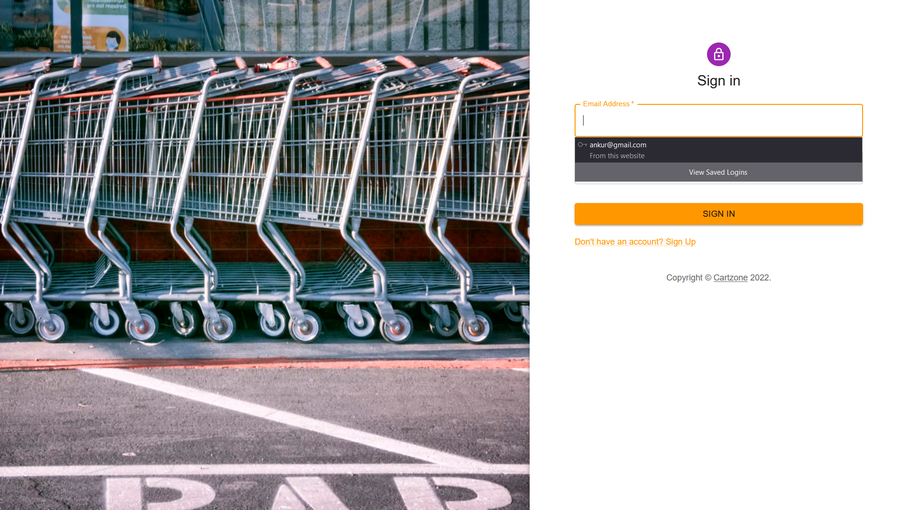

# Cartzone

Microsoft Engage 2022 : Three problem statements were given out of which making an application by using facial reorganization was more  appeasing  to me so I chose to make “CartZone” an application which recommends products according to facial attributes of user ,and to get personalized service as per their requirement and their interests from first visit only. I am still working for the improvement and better working of the application.

## Running instructions with images

Landing page

New Registration(signup)

Camera permission

Camera preview

Capture and submit

Home page

Contact us

Navbar and logout

login page

home page

Product discription 

Purchased

my account

for personnalised product for mates feature

products

logout

## Features
1. This application is designed to give product suggestion to users according to their facial Specifications.
2. It gives personalized product suggestion in first visit which makes user free from hactic job of filling forms for intrest or wait for the engine to read the intrest or requierements ;

## RoadMap
|  Week  |            Task Completed           |
|:------:|:-----------------------------------:|
| week 1 | 1.Research to  decide project       |
|        | 2.searched for resources            |
| week 2 | 1.selected one project              |
|        | 2.compared and selected Techstack   |
|        | 3.Setup API                         |
| week 3 | 1.Completed all pages and connected |
|        | 2.Setup Recommendations             |
|        | 3.completed design                  |
________________________________________________

## Technologies used
1. React JS - a free and open-source front-end JavaScript library for building user interfaces or UI components. Maintained by Facebook React is used to develop single page progressive web apps
2. Firebase – A cloud-hosted Realtime NoSQL database used to store and sync data between users in Realtime. Also used to authenticate and manage users.
3. Microsoft Azure face API- The Azure Face service provides AI algorithms that detect, recognize, and analyze human faces in images. Facial recognition software is important in many different scenarios, such as identity verification, touchless access control, and face blurring for privacy.

## If you want to build on your system

This project was created with [Create React App](https://github.com/facebook/create-react-app).

Run `npm install` (Requires [Node.js](https://nodejs.org/en/)) to install dependencies.

Run `npm start` to run. It runs the app in the development mode. Open [http://localhost:3000](http://localhost:3000) to view it in your browser.

The page will reload when you make changes.

Run `npm run build` to build. Builds the app for production to the `build` folder. It correctly bundles React in production mode and optimizes the build for the best performance. The build is minified and the filenames include the hashes.
